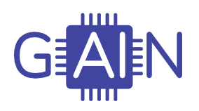
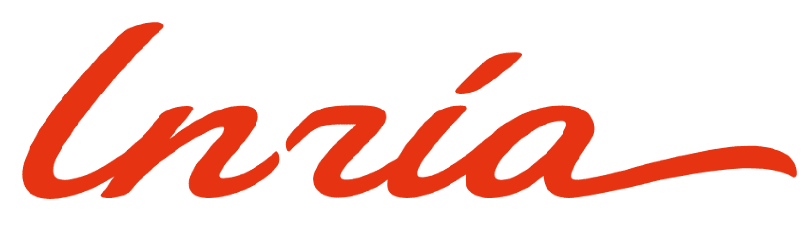

# 👋 Welcome


```{note}
This project is a part of the work that you can find here
```


### **EEGain**

EEGain Framework is a powerful and user-friendly Python library built on top of PyTorch, designed to simplify the development of EEG (Electroencephalography) tasks such as emotion recognition.
With just a few lines of code, you can effortlessly import popular datasets like DEAP, SEED, MAHNOB, and DREAMER, and create intuitive preprocessing pipelines.
Additionally, you can import most popular models such as EEGNet, EMotionNet, TSception, DeepConvNet, and Bender to establish baselines quickly.


```{admonition} Main Idea
- Import popular datasets: **MAHNOB**, **SEED**, **DEEP**, **DREAMER** and much more
- Create preprocessing steps using our module
- Use popular models: **EEGNet**, **TSception**, **Deepconvnet**, **Bender** and more for creating baselines quickly
- Just run the training part and check the report
```


### **Why EEGain Framework?**

The field of EEG analysis often poses significant challenges, especially for newcomers who struggle to comprehend the complexities of datasets and their structures. In addition to the complex dataset structures, running baselines, applying preprocessing steps, and conducting evaluations in EEG analysis lack standardization, further complicating the research process
EEGain Framework aims to address these challenges by providing a streamlined and standardized solution. With our framework, newcomers can easily navigate and understand the intricate structures of popular EEG datasets. By simplifying the process of running baselines, users can quickly establish a foundation for their research. Moreover, we offer a comprehensive set of preprocessing steps that are commonly used in the field, enabling researchers to apply them effortlessly and efficiently.


### **Who is it for?**

The EEGain Framework is designed for a broad audience, including researchers, data scientists, and developers working in the field of EEG analysis.
Whether you are an experienced practitioner or a newcomer, this framework caters to all skill levels, allowing anyone to harness the power of EEG data for emotion recognition tasks.


### **Future Perspectives**

EEGain Framework is an evolving project with exciting future prospects. We are committed to expanding the framework's capabilities and providing ongoing support for additional datasets, models, and evaluation metrics.
Our vision is to establish EEGain Framework as the go-to resource for EEG analysis, empowering researchers to explore the vast potential of EEG data for a wide range of applications.


### **Say Hello to our Heroes**

|  |                                                                                                                                                                                                                                                                                                                   |
| :---: |:--------------------------------------------------------------------------------------------------------------------------------------------------------------------------------------------------------------------------------------------------------------------------------------------------------------------------------------------------------------------------------------------------------------:|
| **Raphael**<br> small description |                                                                                                                                                                                        **Tatia**<br> small description                                                                                                                                                                                         |
|  |                                                                                                                                                                                                                                                                                                                     |
| **Natia**<br> small description | **Sofio Katamadze**<br> Sofio is Senior Software Engineer in EPAM Georgia. <br> She has 10+ years of strong background in software development. She holds a PhD degree in computer engineering and is Assistant Professor at the Caucasus University and University of Georgia. <br>She gives lectures in above mentioned universities  in the direction of programming. She is supervisor of students theses. |


## **Mentors**

We would like to express our deep appreciation to our colleagues and mentors for their unwavering support and knowledge sharing. They have guided us in the field of EEG and provided us with constant inspiration throughout the development journey of the EEGain Framework
Their dedication and commitment have been invaluable in pushing the boundaries of EEG analysis and making this framework a reality.

|                   |  |  |
|:---------------------------------------------------------------------------------------------------------------:|:--------------------------------------------------------------------------------------------------:|:----------------------------------------------------------------------------------------------------:|
|                                         **Laura**<br> small description                                         |                                 **Philipp**<br> small description                                  |                                  **Benedikt**<br> small description                                  |


## **Partnership**

The project was partially supported by European Commission
HORIZON EUROPE WIDERA-2021-ACCESS-03 Grant Project GAIN (grant agreement no.101078950)

|  |  |  |  |
|:----------------------------------------:|:-----------------------------------------------:|:------------------------------------------------:|:-----------------------------------------------:|
